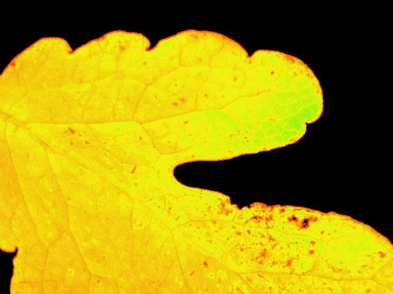
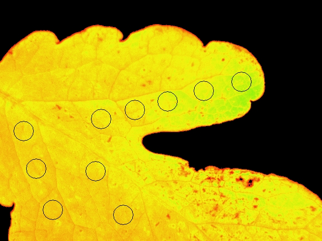

```{r}
SciViews::R
```

Les étudiants ont réalisé des mesures de fluorescence sur des organismes végétaux 



Un ensemble de zone d'intérêt sont défini sur l'image afin de mesurer la fluorescence. 



Les images ont été analysées et les données de fluorescence ont été extraite puis importé dans R

```{r, warning=FALSE, message=FALSE}
source("../../R/pam/import_yield.R")

fs::dir_ls("../../data/pam/") %>%
  purrr::map_dfr(pam_yield) -> ip

ip %>.%
  mutate(., file = str_remove_all(file, "^../../data/pam/"),
         file = str_remove_all(file, ".csv")) -> ip

DT::datatable(ip, caption = "Tableau des données obtenues avec l'Imaging-Pam")
```

Les valeurs de rendement photosynthétique effectif sont mis en avant sur le graphique suivant

```{r, fig.cap= "Variation du rendement photosynthétique effectif de différents organismes vétagaux"}
chart(ip, yield ~ as.factor(file)) +
  geom_point() + 
  scale_y_continuous(limits = c(0,1)) +
  labs(y = "Rendement photosynthétique effectif", x = "Echantillons")
#ggsave(filename = "figures/ip.png", device = "png")
```

