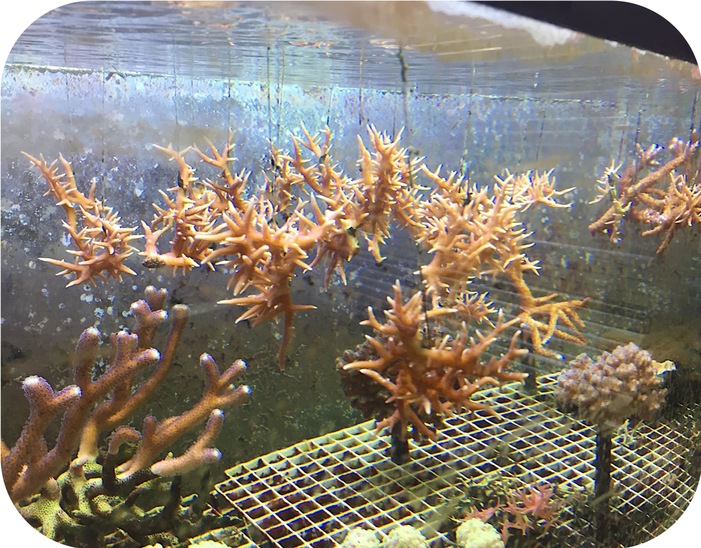
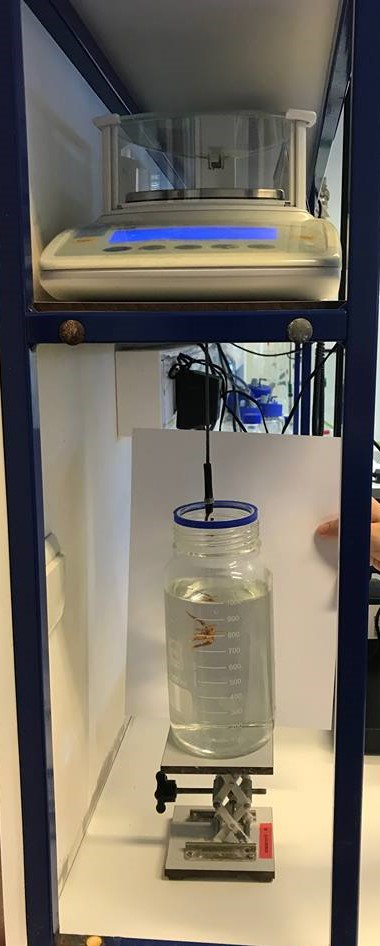

```{r setup, include=FALSE}
knitr::opts_chunk$set(echo = FALSE, warning = FALSE)
SciViews::R
source("../../R/coral_growth/skeleton_weight.R")
```

### Organisation de l'activité

L'activité se divise en 3 étapes :

- 1h30 : Recherche bibliographique sur la croissance des coraux
- 0h30 : Discussion et débriefing sur les méthodes permettant de mesurer la croissance  
- 1h : Recherche bibliograpique sur le modélisation de la croissance des coraux
- 1h : Discussion et débriefing de la modélisation de la croissance des coraux
- 2h : Rédaction du rapport

### Croissance des coraux

Comment évaluer simplement la croissance des coraux ? Quelles sont les méthodes employées ? 

{width=60%}


### Débriefing sur la croissance des coraux 

\columnsbegin
\columnsmall

{width=65%}

\columnlarge

Au sein du laboratoire d'Econum, nous employons afin de quantifier en routine la croissance des coraux le masse immergée.

$$w_{a} = \frac{w_{w}}{1 - \frac{D_w}{D_a}}$$

où $w_{a}$ est le poids du squelette (principalement composé d'aragonite),  $w_{w}$ est le poids immergé, $D_w$ est densité de l'eau de mer (qui peut être calculé via la fonction `rho()` du package `seacarb`), $D_a$ est la densité de l'aragonite  qui est de $2390 \ g/dm^3$.

\columnsend

### Modélisation de la croissance des coraux

```{r}
data.io::read("coral_growth", package = "coral.growth") %>.%
  mutate(., 
         skw = skeleton_weight(buoyant_weight = weight, S = salinity,
                                  T = temperature),
         skw_log = log(skw)) %>.%
  filter(., id == "5") -> cg

cg %>.%
  filter(., date <= 30) -> cg_red
```

Partons d'un cas concret avec une bouture d'une masse initiale de `r round(min(cg_red$skw),3)`.


Au bout de `r round(max(cg_red$date),0)`, la bouture a une masse de `r round(max(cg_red$skw),3)` grammes. 


**Quelle sera la masse de notre bouture au bout de `r round(max(cg$date),0)` jours ? **

____

```{r, fig.width=5, fig.height=3, fig.cap= "Evolution de la masse squelettique (g)  d'une bouture de corail au cours du temps (jour)", fig.align='center'}
chart(cg_red, skw ~ date) +
  geom_line() +
  geom_point() +
  labs( y = "Masse squelettique [g]", x = "Temps [J]")
```

### Débriefing sur la modélisation des coraux 

```{r, fig.width=5, fig.height = 2.75, fig.cap= "Validation de modéle prédictif de la masse squelettique (g) d'une bouture de corail au cours du temps (jour).", fig.align='center'}
lm1 <- lm(data = cg_red, skw ~ date)
coef1 <- lm1$coefficients[2]

lm2 <- lm(data = cg_red, skw_log ~ date)
coef2 <- lm2$coefficients[2]

dt <- tibble(date = seq(from = min(cg_red$date), to = max(cg_red$date) + 30))
dt$y <- min(cg_red$skw) + coef1*dt$date
dt$y1 <- min(cg_red$skw) * exp(coef2*dt$date)


chart(cg, skw ~ date) +
  geom_point() +
  geom_line(f_aes(y ~ date), data = dt) +
  geom_line(f_aes(y1 ~ date), data = dt, color = "red") +
  geom_vline(xintercept = 30, linetype = "dashed", color = "blue") +
  geom_label(aes(x = 15, y = max(cg$skw), label = "Set d'apprentissage")) +
  geom_label(aes(x = 45, y = max(cg$skw), label = "Set de test")) +
  labs(y = "Masse squelettique [g]", x = "Temps [J]")
```

### Rapport

Vous devez réaliser un rapport commun pour l'ensemble des participants. Ce dernier doit contenir : 

- une introduction sur les coraux et les méthodes pour évaluer les croissances (théorique).

- une réflexion sur la meilleure méthodes

- une introduction sur les modèles de croissance des coraux

- une réflexion sur le meilleur modèle de croissance

- une petite conclusion sur la croissance et la modélisation de cette croissance.

Il est préférable de réaliser ce rapport dans un projet RStudio cohérent.
