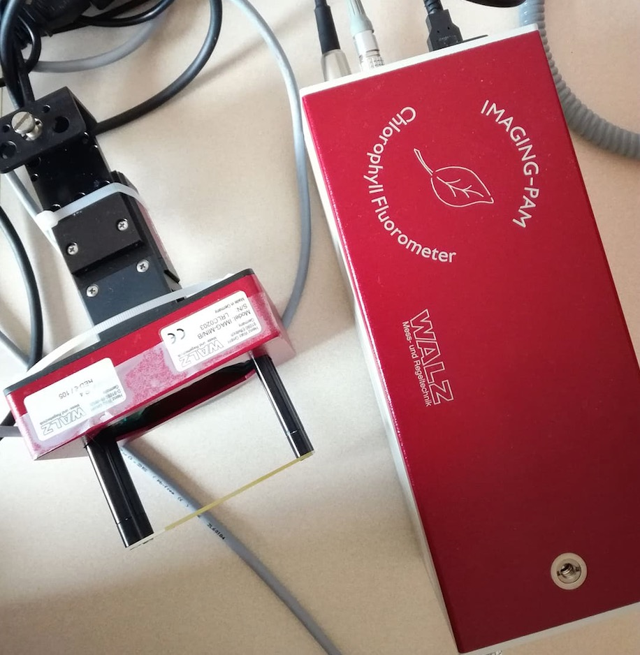
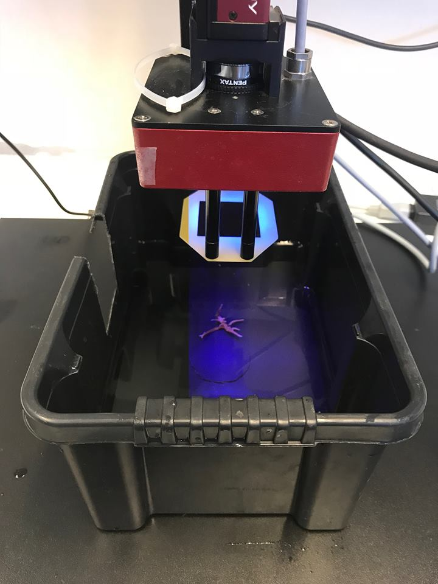
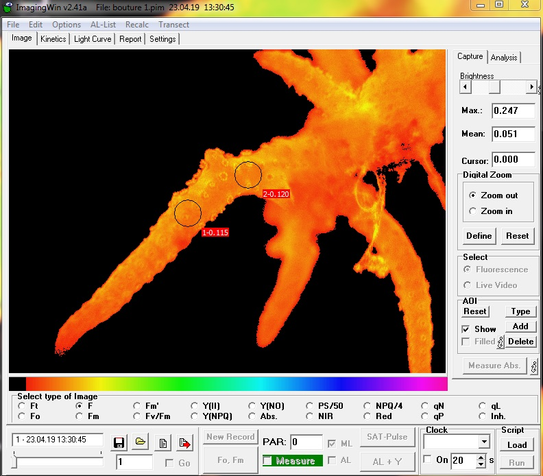

```{r setup, include=FALSE}
knitr::opts_chunk$set(echo = FALSE, warning = FALSE)
SciViews::R
urchin <- read("urchin_bio", package = "data.io", lang = "fr")
```

### Organisation de l'activité

L'activité se divise en X éapes :

- 2h : Bibliographique sur la fluorescence 
- 2h : Utilisation de l'Imaging PAM
- 2h : Rédaction du rapport

### Fluorescence

La fluorescence émise quantifie de manière indirecte \alert{la photosynthèse} tout comme la production d'oxygène. Avant d'employer l'Imaging Pam, vous devez avoir une vision précise de la photosynthèse et du role de la fluorescence dans ce méchanisme.

Une fois vos idées claires sur la photosynthèse, vous allez vous intéressez à l'utilisation du PAM dans l'ecophysiologie des **animaux aquatiques**.

### Imaging Pam

\columnsbegin
\columnlarge

{width=80%}

\columnsmall

L'Utilisation de l'Imaging Pam peut se décomposer en 3 étapes :

- Prise de mesures
- Analyse des images obtenues
- Traitement des données obtenues

\columnsend

----

\columnsbegin

\columnhalf 

{width=90%}

\columnhalf 

L'imaging PAM permet d'obtenir une image en 2D de l'organisme d'intérêt. 

{width=75%}

\columnsend

----

L'image obtenue peut être analysée et les mesures peuvent être extraites au format .csv. 

{width=55%}

Comme vous pouvez le voir, différentes zones d'intérêt peuvent être placé sur l'image brute.

### Rapport

Vous devez réaliser un rapport commun pour l'ensemble des participants. Ce dernier doit contenir : 

- une introduction sur la photosynthèse, la fluorescence et l'utilisation du PAM (théorique).

- une description de l'utilisation du PAM

- une petite conclusion sur les avantages (et les inconvénients) d'employer cet outil 

Il est préférable de réaliser ce rapport dans un projet RStudio cohérent.
